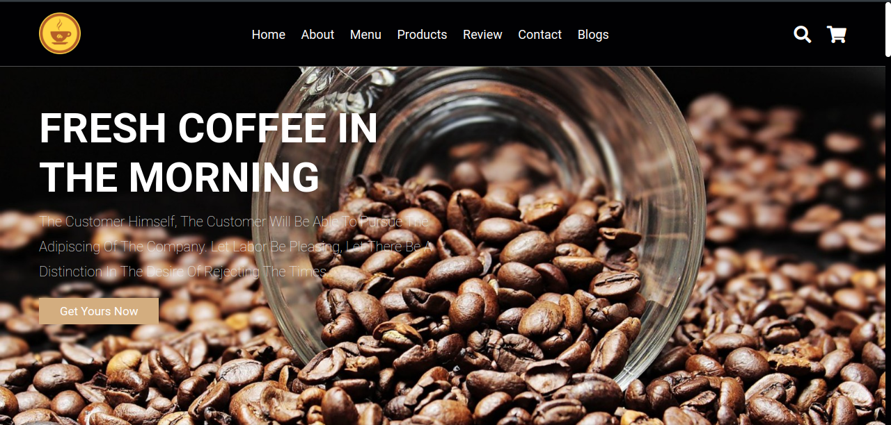
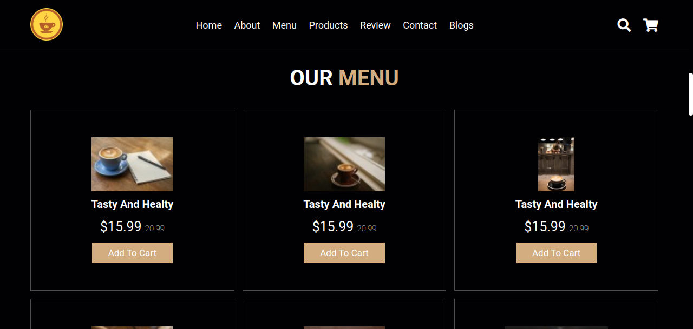
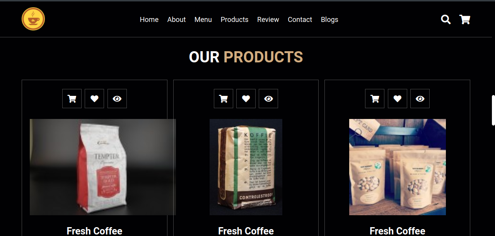

# Coffee Shop Website

A visually appealing and responsive website for a coffee shop. The website features sections like Home, About, Menu, and Contact, with smooth animations, mobile-first design, and interactive elements like a navigation bar and contact form.



---

## Table of Contents

1. [Project Overview](#project-overview)
2. [Technologies Used](#technologies-used)
3. [Features](#features)
4. [Installation](#installation)
5. [File Structure](#file-structure)
6. [How to Run Locally](#how-to-run-locally)
7. [Screenshots](#screenshots)
8. [Contributing](#contributing)
9. [License](#license)

---

## Project Overview

This Coffee Shop website offers a fully responsive and modern design. It allows users to explore the coffee shop’s offerings, view the menu, learn about the shop, and easily contact the business. The layout is mobile-first, ensuring a smooth and engaging experience for users across all devices.

---

## Technologies Used

- **HTML** - For structuring the website’s content.
- **CSS** - For styling the layout and ensuring the site is responsive.
- **JavaScript** - For interactive features like toggling the navbar.
- **Google Fonts** - For using the `Roboto` font family to enhance the website’s design.
- **CSS Flexbox & Grid** - For building a responsive layout that adjusts to different screen sizes.

---

## Features

- **Responsive Design**: The website automatically adjusts to different screen sizes, ensuring a smooth experience on desktops, tablets, and mobiles.
- **Sticky Navbar**: The navigation bar stays fixed at the top of the page as users scroll.
- **Home Section**: A hero section with a background image and introductory text.
- **About Section**: Learn more about the coffee shop's history, values, and offerings.
- **Menu Section**: A grid layout displaying the coffee shop's menu items with images and descriptions.
- **Contact Section**: A contact form for inquiries and an embedded map showing the shop’s location.
- **Footer**: Contains contact links and social media icons.
- **Smooth Animations**: Hover effects and transitions on interactive elements for a polished feel.
- **Mobile Navigation**: A hamburger menu that appears on mobile devices for easy access to links.

---

## Installation

### Clone the Repository

```bash
git clone https://github.com/Lusanda11/Coffee-Shop.git
cd Coffee-Shop
```
### Open the Project
1. Open the project folder in your code editor (e.g., VS Code).
2. Run the project using the live-server extension or simply open the `index.html` file in your browser.

---
## File structure

```graphql
coffee-shop-website/
│
├── assets/               # Images and other static assets (e.g., background images, icons).
│  └── home.jpg          # Home section background image.
│
├── JS/                   # Functionality of the web page.
│  └── coffeeShop.js     # Main JavaScript file (original version).
│
├── CSS/                  # Stylesheets.
│   └── coffeeShop.css   # Main CSS file (original version).
│
├── index.html            # Main HTML file.
└── README.md             # Project documentation.
```
---

## How to Run Locally

1. Clone this repository to your local machine:
    ```bash
    git clone https://github.com/Lusanda11/Coffee-Shop.git
    ```
2. Navigate into the project directory:
    ```bash
    cd Coffee-Shop
    ```
3. Open the `index.html` file in your preferred browser or use a local server to run the project.    

---

## Screenshots
Here are some preview images of the website:

### Menu Section



### Products



---

### Contributing
Feel free to contribute to this project! You can submit issues or create pull requests for bug fixes or feature improvements.

**Steps to Contribute:**
1. Fork the repository
2. Create a new branch (`git checkout -b feature-name`)
3. Make your changes
4. Commit your changes (`git commit -am 'Add feature'`)
5. Push to the branch (`git push origin feature-name`)
6. Create a pull request

---

## License
This project is licensed under the unlicensed.

---

### **Additional Notes:**
- **Responsiveness:** The website is designed to adjust fluidly across different screen sizes using CSS Flexbox and Grid.
- **Fonts:** The `Roboto` font is imported from Google Fonts for a modern and readable style.
